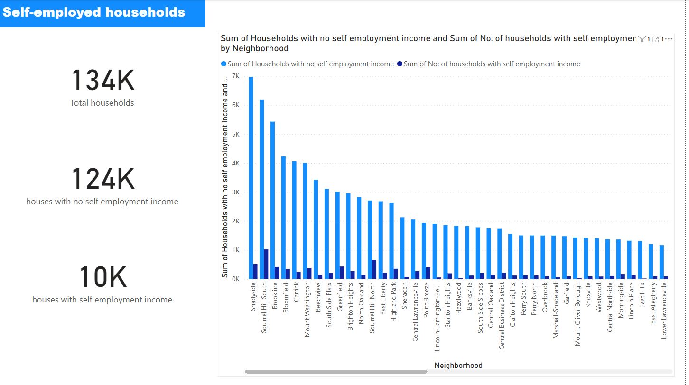

# Household Income Analysis: Self Employment Distribution

---

## Project Overview

This project analyzes household income data to understand the **distribution of self employed households across neighborhoods** and identify areas that may benefit from targeted economic support. 

The objective was to simulate a real-world scenario where **messy, unstructured data is cleaned and transformed into actionable insights** for policymakers and planners.

The workflow focuses on:

* Cleaning and standardizing real world data
* Preparing it for analysis
* Visualizing patterns in self employment distribution

---

## Business Questions

1. How are self employed households distributed across neighborhoods?
3. Is self employment evenly distributed or localized to specific regions?
4. What insights can support targeted economic policy decisions?

---

## Key Insights

* **Low Overall Presence:** Households with self employed income represent a **small portion** of total households across most neighborhoods.

* **Uneven Distribution:** Self-employment is **not evenly distributed**, with certain neighborhoods showing noticeably higher concentrations.

---

## Tools Used

* **OpenRefine** → Data cleaning, transformation, and standardization
* **Power BI** → Data modeling and dashboard visualization

---

## Data Cleaning & Preparation

The dataset contained multiple real-world data quality issues, making it unsuitable for direct analysis.

Using **OpenRefine**, the following steps were performed:

* Removed irrelevant and redundant columns
* Standardized inconsistent categorical values using clustering
* Cleaned blank and malformed entries
* Renamed columns for clarity and consistency
* Ensured all fields were structured and analysis-ready

This process ensured that the dataset was **reliable and suitable for visual analysis**.

---

## Dashboard Features

* Neighborhood level analysis of self-employment distribution
* Aggregated metrics and chart

* **Screenshot of Dashboard**

---

## Business Implications

* Self employment trends are **localized rather than widespread**, suggesting targeted interventions are more effective than broad policies.
* Policymakers can focus resources on **high-concentration areas** to support entrepreneurial activity.
* Different neighborhoods may require **tailored economic strategies** based on their self-employment levels.

---

## Conclusion

This project demonstrates the ability to:

* Clean and structure messy real-world datasets using OpenRefine
* Prepare data for analysis and visualization
* Extract meaningful insights to support decision-making
* Communicate findings through a clear and focused dashboard

It reflects a practical workflow from **raw data → cleaned dataset → business insights**.

---

## Limitations

* Analysis is based on available indicators and does not include income magnitude
* Results reflect **presence of self employment**, not financial performance
* Findings should be interpreted as indicative rather than definitive
